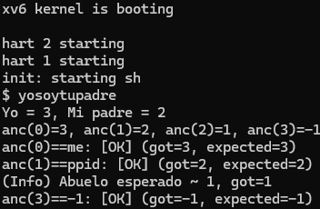

# INFORME – Tarea 1: Implementación de Llamadas al Sistema en xv6  

**Autores:** Renato Calvo, Marcelo Pino  

---

## 1. Funcionamiento de las nuevas llamadas al sistema  

Se añadieron dos nuevas system calls al kernel de xv6:  

- **getppid(void):** devuelve el identificador (PID) del proceso padre del proceso actual.  
- **getancestor(int n):** retorna el PID del ancestro `n`-ésimo:  
  - `getancestor(0)` → PID del propio proceso.  
  - `getancestor(1)` → PID del padre.  
  - `getancestor(2)` → PID del abuelo.  
  - Si el ancestro no existe, retorna `-1`.  

Estas llamadas permiten inspeccionar la jerarquía de procesos y comprobar la relación entre `init`, `sh` y los programas de usuario.  

---

## 2. Cambios realizados en xv6  

El patrón seguido fue el de la syscall existente `getpid`. Los ajustes se hicieron en los siguientes archivos:  

- `kernel/syscall.h`: se asignaron los números `SYS_getppid = 22` y `SYS_getancestor = 23`.  
- `kernel/syscall.c`: se declararon los handlers y se añadieron a la tabla de syscalls.  
- `kernel/sysproc.c`: se implementó la lógica de ambas llamadas.  
- `user/user.h`: se incluyeron los prototipos visibles desde userland.  
- `user/usys.pl`: se añadieron entradas para generar los wrappers.  
- `user/yosoytupadre.c`: se creó el programa de prueba.  
- `Makefile`: se agregó `$U/_yosoytupadre` a la lista de programas de usuario.  

---

## 3. Ejecución de pruebas  

Luego de compilar con `make qemu`, se ejecutó el programa de prueba `yosoytupadre` desde la consola de xv6. El resultado obtenido fue:  

### Captura de pantalla  
  

Esto confirma:  
- El proceso actual (`yosoytupadre`) tiene PID=3.  
- Su padre es el shell (`sh`, PID=2).  
- El abuelo corresponde al proceso `init` (PID=1).  
- No existen ancestros más arriba, por lo que `getancestor(3)` retorna `-1`. 

---

## 4. Dificultades encontradas  

- **Archivos a intervenir:** al inicio no era evidente cuáles modificar. La estrategia fue buscar todas las referencias de `getpid`, lo que reveló los cinco archivos clave.  
- **Confusión con los PIDs:** inicialmente se pensaba que los PIDs de padre, hijo y abuelo debían ser correlativos. Luego se entendió que los PIDs reflejan la jerarquía de procesos y no necesariamente son números consecutivos.  
  Ejemplo:  
init (PID=1)
└─ sh (PID=2)
└─ yosoytupadre (PID=3)

---

## 5. Conclusiones  

La tarea permitió comprender de manera práctica el ciclo completo de una syscall en xv6: desde su definición en el kernel hasta su invocación en espacio de usuario.  
Los resultados de las pruebas confirmaron que tanto `getppid` como `getancestor` funcionan correctamente, mostrando la jerarquía de procesos tal como se esperaba.  

---

## 6. Entrega  

El código fuente modificado, el programa de prueba y este informe se encuentran en la siguiente rama de GitHub:  

[Enlace a la rama de entrega](https://github.com/renatofas/xv6-riscv/tree/ramaT1)  