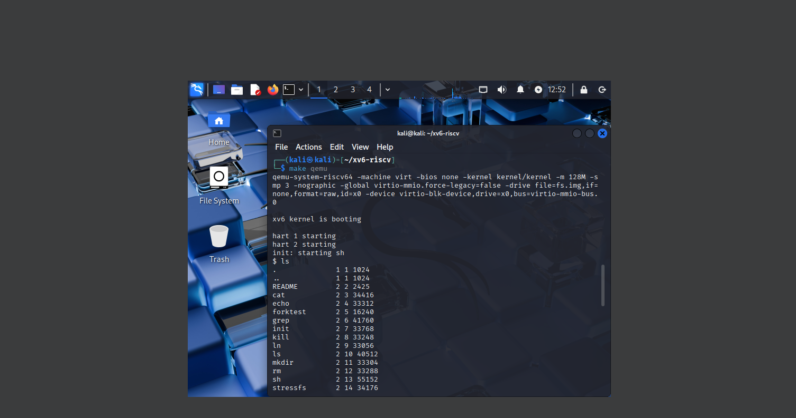
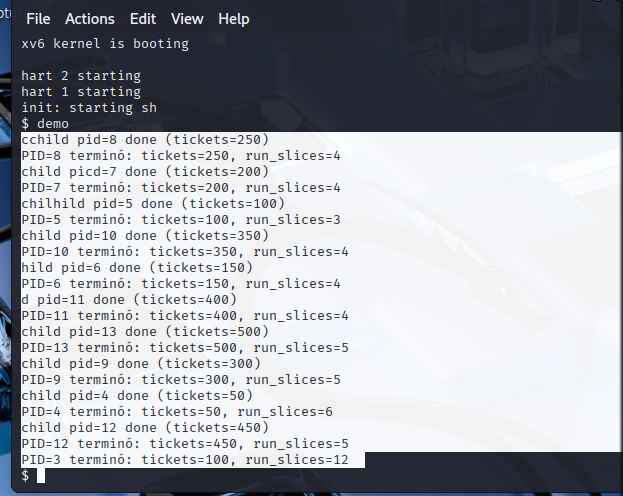

# Tarea 2 — Lottery Scheduling en xv6-riscv

**Alumno:** Renato Calvo - Marcelo Pino
**Curso:** Sistemas Operativos  
**Entrega:** Tarea 2 — Implementación de planificador por Lotería  
**Rama:** `ramaT2`  
**Repositorio:** https://github.com/renatofas/xv6-riscv/tree/ramaT2

---

## Funcionamiento y lógica de la implementación

El objetivo de esta tarea fue modificar el sistema operativo xv6 para implementar un **Lottery Scheduler**, reemplazando el planificador Round Robin.  
Cada proceso obtiene una cantidad de *tickets*, y la probabilidad de ser seleccionado por la CPU es proporcional a esa cantidad.

El funcionamiento general del planificador es:

1. Cada proceso posee un campo `tickets` (número de boletos de CPU).  
2. En cada iteración del `scheduler()`:
   - Se suman los tickets de todos los procesos en estado `RUNNABLE`.
   - Se genera un número aleatorio `r` entre 1 y el total de tickets.
   - Se recorre nuevamente la tabla acumulando tickets hasta que `acc >= r`.
   - El proceso correspondiente gana la “lotería” y se ejecuta.
3. Cada vez que un proceso gana la lotería, se incrementa su contador `run_slices`.
4. Al finalizar (`exit()`), el sistema imprime el PID, los tickets asignados y las veces que fue ejecutado (`run_slices`).

Este enfoque busca simular una distribución probabilística justa del uso de CPU.

---

## Archivos modificados y cambios realizados

### `kernel/proc.h`
Se agregaron dos nuevos campos a la estructura `proc`:
```c
int tickets;     // cantidad de tickets de CPU
int run_slices;  // contador de veces que fue elegido por el scheduler
```

### `kernel/proc.c`
#### `allocproc()`
Inicialización de los nuevos campos:
```c
p->tickets = 100;   // valor por defecto
p->run_slices = 0;
```

#### `scheduler()`
Se reemplazó la lógica Round Robin por el algoritmo de lotería.
```c
for(;;){
  intr_on();
  int total_tickets = 0;

  // Calcular total de tickets
  for(p = proc; p < &proc[NPROC]; p++){
    acquire(&p->lock);
    if(p->state == RUNNABLE){
      if(p->tickets < 1)
        p->tickets = 1;
      total_tickets += p->tickets;
    }
    release(&p->lock);
  }

  if(total_tickets == 0)
    continue;

  // Generar número aleatorio entre 1 y total_tickets
  int winner = rand() % total_tickets;
  int acc = 0;
  struct proc *chosen = 0;

  // Buscar proceso ganador
  for(p = proc; p < &proc[NPROC]; p++){
    acquire(&p->lock);
    if(p->state == RUNNABLE){
      acc += p->tickets;
      if(acc > winner){
        chosen = p;
        break;
      }
    }
    release(&p->lock);
  }

  // Ejecutar proceso ganador
  if(chosen){
    chosen->state = RUNNING;
    chosen->run_slices++;
    swtch(&c->context, &chosen->context);
    release(&chosen->lock);
  }
}
```

#### `exit()`
```c
printf("PID=%d terminó: tickets=%d, run_slices=%d\n",
       p->pid, p->tickets, p->run_slices);
```

Se añadió un generador pseudoaleatorio simple (LCG) para los sorteos.

---

### `kernel/sysproc.c`
```c
uint64 sys_settickets(void) {
  int n;
  argint(0, &n);
  if (n < 1)
    n = 1;
  myproc()->tickets = n;
  return 0;
}
```

### `kernel/syscall.h`
```c
#define SYS_settickets 22
```

### `kernel/syscall.c`
```c
extern uint64 sys_settickets(void);
static uint64 (*syscalls[])(void) = {
  ...
  [SYS_settickets] sys_settickets,
};
```

### `user/user.h`
```c
int settickets(int n);
```

### `user/usys.pl`
```perl
entry("settickets");
```

### `Makefile`
```makefile
UPROGS=\
    ...
    $U/_demo\
```

### `user/demo.c`
```c
#include "kernel/types.h"
#include "user/user.h"

int main(void) {
  int n = 10;
  int base = 50;
  for(int i = 0; i < n; i++){
    int pid = fork();
    if(pid == 0){
      int t = base * (i+1);
      settickets(t);
      for(volatile int j = 0; j < 5000000; j++);
      exit(0);
    }
  }
  for(int i = 0; i < n; i++)
    wait(0);
  exit(0);
}
```

---

## Dificultades y soluciones

| Dificultad | Solución |
|-------------|-----------|
| `argint()` no retorna valor. | Eliminé la comparación y validé manualmente el parámetro. |
| No existía `usys.S`. | xv6 genera `usys.S` desde `usys.pl`. |
| Error de `git push`. | Se usó un **PAT** con permisos `repo`. |
| Posible división por cero. | Se validó `if(total_tickets == 0) continue;`. |

---

## Contabilidad y robustez

- Se garantiza mínimo **1 ticket** por proceso.  
- `run_slices` se incrementa solo una vez por ejecución efectiva.  
- Uso correcto de `locks` en el scheduler.  
- Sin deadlocks ni starvation prolongado.  
- Ajuste automático de tickets inválidos.

---

## Programa de prueba

**Ejecución dentro de xv6:**
```bash
$ demo
```

**Salida esperada:**


```
---

## Posibles problemas del Lottery Scheduler

1. No garantiza equidad exacta.  
2. Puede haber starvation temporal.  
3. Resultados aleatorios en ejecuciones cortas.  
4. Complejidad O(N).  
5. RNG puede sesgar resultados.  
6. No es determinista.

---

## Compilación y ejecución

```bash
make clean && make
make qemu
$ demo
Ctrl + A, X  # para salir
```

---

## Archivos modificados

- `kernel/proc.h`
- `kernel/proc.c`
- `kernel/sysproc.c`
- `kernel/syscall.h`
- `kernel/syscall.c`
- `user/user.h`
- `user/usys.pl`
- `Makefile`
- `user/demo.c`

---

## Conclusión

Se implementó correctamente un **planificador de tipo Lotería** en xv6, incorporando la syscall `settickets()`, los campos `tickets` y `run_slices`, un nuevo `scheduler()` y un programa de prueba (`demo.c`).  
El sistema funciona de forma estable y permite observar el comportamiento probabilístico de la CPU entre procesos.

---
