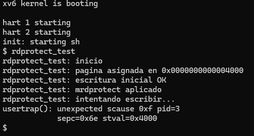

# Tarea 3 – Desactivación y restauración de permiso de lectura (mrdprotect / munrdprotect)

Autores: Marcelo Pino y Renato Calvo

## 1. Objetivo y mecanismo
Se añadieron dos rutinas al kernel de xv6 para permitir que un proceso modifique el bit de lectura (PTE_R) de páginas propias:
- mrdprotect(void *addr, int len): recorre len páginas desde addr y borra PTE_R.
- munrdprotect(void *addr, int len): recorre el mismo rango y establece PTE_R.

Operan sobre la pagetable del proceso activo (myproc()->pagetable). Antes de alterar cada PTE se valida:
1. Dirección alineada a PGSIZE.
2. PTE existente (walk(...,0) distinto de 0).
3. Bit PTE_V presente.
4. Bit PTE_U presente (evitar páginas del kernel).

Solo se toca PTE_R; el resto de bits permanece igual. Al terminar se llama a sfence_vma() para limpiar TLB.

Flujo por página:
```
va = base + i*PGSIZE
pte = walk(pagetable, va, 0)
validar -> modificar bit -> continuar
```

## 2. Integración en el kernel
Archivos modificados:
- kernel/vm.c: implementación núcleo.
- kernel/sysproc.c: wrappers sys_mrdprotect / sys_munrdprotect.
- kernel/syscall.h: números de syscall añadidos.
- kernel/syscall.c: tabla de despacho actualizada.
- kernel/defs.h: prototipos internos.
- user/user.h y user/usys.pl: exposición a espacio de usuario.
- Makefile: inclusión del ejecutable de prueba rdprotect_test.

Las funciones retornan 0 en éxito y -1 ante cualquier validación fallida (len <= 0, desalineación, ausencia de PTE, falta de PTE_V, falta de PTE_U).

## 3. Programa de prueba (rdprotect_test)
Secuencia:
1. sbrk(4096) para reservar una página.
2. Escritura inicial para materializarla.
3. mrdprotect(addr,1).
4. Segundo acceso (escritura o lectura) que desencadena fault.
5. (Restauración solo observable en escenarios controlados antes del fault).

La ejecución muestra un trap con scause=0xF (Load/Store Access Fault). xv6 marca el evento como “unexpected trap” y finaliza el proceso, confirmando que el bit PTE_R fue limpiado.

Salida ilustrativa:



## 4. Restricciones de la arquitectura RISC-V
RISC-V no admite páginas “solo escritura”: si PTE_W=1 y PTE_R=0 la combinación se considera inválida y cualquier acceso (lectura o escritura) puede generar el fault. Por ello el fallo puede ocurrir antes de la lectura prevista. El comportamiento obedece al hardware, no a la lógica del kernel. Retirar la escritura previa permite observar el fault justo en la lectura, verificando la ausencia de PTE_R.

## 5. Riesgos y consideraciones
- Un proceso puede auto-provocarse fallos retirando permisos críticos.
- Necesario tocar la página (escribir) antes de proteger para asegurar mapeo físico.
- xv6 carece de manejadores especializados para distinguir tipos de acceso prohibido, terminando rápidamente el proceso.
- El mecanismo ilustra control de permisos aunque el entorno educativo omite protecciones modernas (ASLR, COW, etc.).

## 6. Conclusiones
Las nuevas llamadas permiten inhabilitar y restaurar el permiso de lectura mediante edición directa de PTEs. El trap observado prueba la efectividad del cambio en el bit PTE_R. Se consolidan nociones de:
- Manipulación de tablas de páginas.
- Validación de permisos.
- Interacción syscall ↔ kernel.
- Limitaciones de la ISA RISC-V respecto a combinaciones de acceso.

El resultado cumple la finalidad de la tarea y evidencia el flujo completo de modificación y reflejo inmediato de permisos en memoria de usuario.
